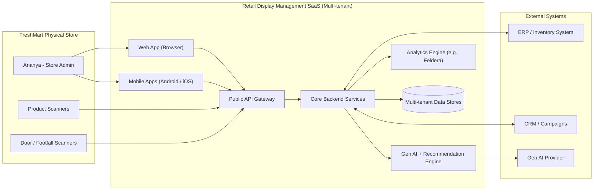
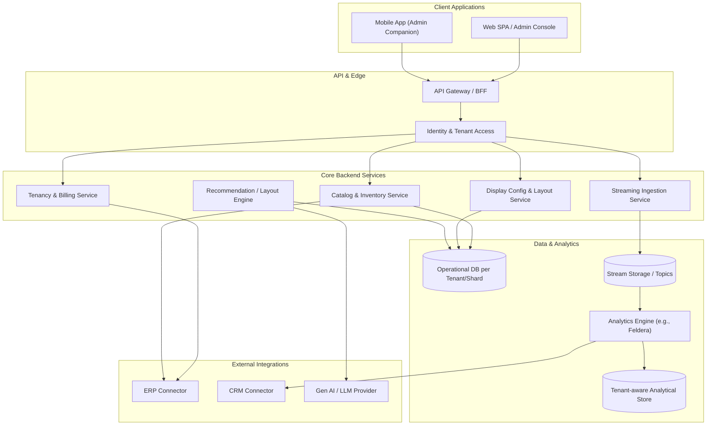
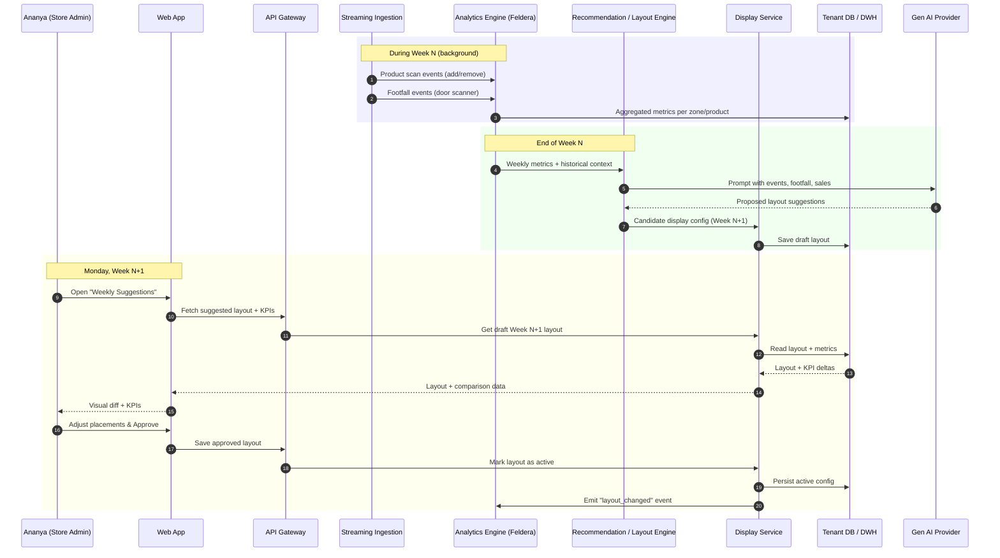

## Golden Path — Retail Store Display Management App

**Tags:** [REQ] [ADR] [RISK] [POC] [DECISION]  
**Scope:** End‑to‑end “happy path” from first touch to ongoing weekly optimization for a single tenant (store).

---

## 1. Story Overview — “Ananya the Store Admin” [REQ]

- **Character**: Ananya, 32, store admin of a mid‑size grocery store in Bengaluru (`FreshMart`), non‑technical, time‑poor, cost‑sensitive.
- **Goal**: Improve in‑store product discovery and weekly sales using smart displays without hiring a data team.
- **System**: Multi‑tenant SaaS Retail Store Display Management App with Web + Mobile (Android/iOS) front ends.  
  - Covers [REQ-F001], [REQ-F012], [REQ-F013], [REQ-NF001], [REQ-NF002], [REQ-NF004], [REQ-NF005].

At a high level, Ananya:

1. **Discovers and signs up** for the SaaS product.  
2. **Self‑provisions a tenant** and completes initial store setup.  
3. **Bootstraps product catalog** (Gen AI + questionnaires + manual edits).  
4. **Pairs hardware scanners** (product + door/footfall).  
5. **Configures and visualizes store displays** (initial and weekly).  
6. **Runs weekly optimization loop** using events, footfall, and sales.  
7. **Reviews analytics** and optionally integrates with ERP/CRM later.

---

## 2. Stage Map — Golden Path Stages [REQ]

| Stage # | Stage Name | Primary Actor | Outcome | Key Requirements |
|--------:|------------|--------------|---------|------------------|
| 1 | Discover & Trial Signup | Ananya (Store Admin) | Trial tenant created and verified | [REQ-F001], [REQ-F013], [REQ-NF006] |
| 2 | Tenant & Store Onboarding | Ananya | Tenant profile, store metadata, locales configured | [REQ-F001], [REQ-F011], [REQ-NF001], [REQ-NF004] |
| 3 | Catalog Bootstrapping | Ananya + Gen AI | Initial product list generated and edited | [REQ-F002], [REQ-F003], [REQ-F004], [REQ-NF003], [REQ-NF009] |
| 4 | Hardware Pairing | Ananya | Product and door scanners paired and streaming synthetic/real data | [REQ-F005], [REQ-F006], [REQ-F007], [REQ-F008], [REQ-NF008], [REQ-NEG:HW-INSTALL]* |
| 5 | Initial Display Design | Ananya | First display configuration designed and visualized | [REQ-F009], [REQ-F010], [REQ-NF004] |
| 6 | Weekly Optimization Loop | Ananya + Engine/LLM | New weekly layout generated, approved, and activated | [REQ-F006], [REQ-F008], [REQ-F009], [REQ-F010], [REQ-NF009] |
| 7 | Analytics & Integrations | Ananya + ERP/CRM (later) | Performance reviewed; optional ERP/CRM integration used | [REQ-F014], [REQ-NF007], [REQ-NF002] |

\* `REQ-NEG:HW-INSTALL` is a **negative/implicit** requirement: hardware installation is out of product scope but must be recognized as a dependency. [RISK]

---

## 3. C1 Context Diagram (Mermaid) [REQ]

This C1 view shows Ananya’s world and how the system fits into it.

- **Traceability:**  
  - Multi‑tenant SaaS + Web/Mobile: [REQ-F001], [REQ-F012].  
  - Streams from scanners: [REQ-F005], [REQ-F006], [REQ-F007], [REQ-F008], [REQ-NF008].  
  - Analytics: [REQ-NF009].  
  - Integrations: [REQ-F014], [REQ-NF007].

---

## 4. C2 Container View (Happy Path Tenant) [REQ]

- **Key golden‑path containers:**  
  - `TEN` for self‑service signup and trials [REQ-F001], [REQ-F013], [REQ-NF006].  
  - `CAT` for CRUD + Gen‑AI assisted catalog [REQ-F002], [REQ-F003], [REQ-F004].  
  - `STR` + `FELD` for streaming ingestion and analytics [REQ-F005]–[REQ-F008], [REQ-NF008], [REQ-NF009].  
  - `DSP` + `REC` for display layout creation and optimization [REQ-F009], [REQ-F010].

---

## 5. Stage‑by‑Stage Golden Path Narrative [REQ]

### 5.1 Stage 1 — Discover & Trial Signup [REQ]

- **Story**:  
  - Ananya sees an online ad / marketplace listing for the app emphasizing **low cost, self‑service, and Gen AI‑powered layouts**.  
  - She opens the Web app, selects **“Start Free Trial”**, and enters store name, email, and phone.
- **System behavior (happy path):**  
  - `TEN` creates a new tenant record and default subscription in **trial** state.  
  - `AUTH` provisions a tenant‑scoped admin account for Ananya and sends a verification email/SMS.  
  - On verification, Ananya is redirected to the **Onboarding Wizard**.
- **Requirements covered:** [REQ-F001], [REQ-F013], [REQ-NF002], [REQ-NF006], [REQ-NF004].  
- **Decisions:** [DECISION] Trial length, limits (e.g., #products, #displays) tuned to protect cost efficiency [REQ-NF003].

### 5.2 Stage 2 — Tenant & Store Onboarding [REQ]

- **Story:**  
  - Ananya logs in and is guided through a 3–5 step wizard: store type, size, location, languages, opening hours, and rough layout zones (e.g., entrance, promo aisle, checkout).
- **System behavior:**  
  - `TEN` stores tenant metadata (industry, size, region).  
  - `DSP` initializes default zones / display areas using templates based on store type.  
  - Localization settings (Indian languages + English) chosen and stored for UI + content [REQ-F011].  
- **Requirements covered:** [REQ-F001], [REQ-F011], [REQ-NF001], [REQ-NF004], [REQ-NF005].  
- **Risks:** [RISK] Overly complex onboarding may cause drop‑off; wizard must stay short and clear [REQ-NF004].

### 5.3 Stage 3 — Catalog Bootstrapping (Gen AI + Questionnaires) [REQ]

- **Story:**  
  - The wizard offers: **“Generate initial catalog”** or **“Import from ERP”** (later).  
  - Ananya chooses **Generate**, answers questions about categories (produce, snacks, beverages), brands, and price ranges.
- **System behavior:**  
  - `CAT` sends prompt with store type + questionnaire answers to `REC`/`LLM`.  
  - `LLM` returns synthetic or AI‑suggested products (names, descriptions, category, price bands, packaging sizes).  
  - Ananya reviews the generated list, **edits a few items**, adds key SKUs manually, and saves.  
  - Products are persisted in `ODS` (tenant‑scoped) and optionally mirrored to analytics (`DWH`) for future baselines.
- **Requirements covered:** [REQ-F002], [REQ-F003], [REQ-F004], [REQ-NF003], [REQ-NF009].  
- **Decisions:** [DECISION] Limit Gen AI volume and fields to control cost and hallucination risk [ARCH-CHAR-003].  
- **Risks:** [RISK] AI‑generated products may not match real inventory; UI must clearly label AI‑suggested vs. confirmed.

### 5.4 Stage 4 — Hardware Pairing & Streaming Data [REQ]

- **Story:**  
  - A “Connect Hardware” step guides Ananya to pair **product scanners** and the **door scanner** with QR codes or registration tokens.  
  - For POC, a “Use simulated data” toggle allows her to continue even without hardware.
- **System behavior:**  
  - `STR` exposes registration endpoints for scanners; on pairing, it assigns them to Ananya’s tenant and location.  
  - Product scanners emit events: `SCAN_ADD`, `SCAN_REMOVE` with SKU and quantity → `STRM` → `FELD` → inventory deltas → `CAT`.  
  - Door scanner emits `FOOTFALL` events with timestamp + attributes (approx. age, gender) → `STRM` → `FELD` → `DWH`.  
  - For POC, synthetic streams emulate real hardware in the same pipeline. [POC]
- **Requirements covered:** [REQ-F005], [REQ-F006], [REQ-F007], [REQ-F008], [REQ-NF008], [REQ-NF009].  
- **Risks:** [RISK] Hardware reliability and network issues; golden path assumes stable connectivity and correctly formatted events.

### 5.5 Stage 5 — Initial Display Design & Visualization [REQ]

- **Story:**  
  - With catalog and basic data in place, Ananya opens **“Displays”** and chooses **“Create First Layout”**.  
  - The system offers templates (e.g., “New Store Opening”, “Festival Promotion – Diwali”, “Everyday Essentials”) and a simple drag‑and‑drop visualization.
- **System behavior:**  
  - `DSP` loads store zones, product categories, and promotion goals.  
  - `REC` may propose recommended product placements based on category rules (e.g., cross‑selling) and any available early data.  
  - Ananya drags product groups onto shelves / gondolas in the visualization and saves the layout as **“Week 0 – Baseline”**.  
- **Requirements covered:** [REQ-F009], [REQ-F010], [REQ-NF004].  
- **Decisions:** [DECISION] Visualization level for MVP (zones and groups vs. 3D render) to balance usability and cost.

### 5.6 Stage 6 — Weekly Optimization Loop [REQ]

- **Story:**  
  - After the first week, Ananya receives a **“Weekly Layout Suggestions Ready”** notification.  
  - She opens the Web app, reviews an automatically proposed **“Week 1 Layout”** and a side‑by‑side comparison of KPIs vs. last week.
- **System behavior:**  
  - `FELD` aggregates:  
    - Inventory changes and sales proxies from product scans.  
    - Footfall counts and demographics by zone/time from door scanner.  
    - Event data (e.g., local festivals, promotions) from an events feed or Gen AI.  
  - `REC` / `LLM` uses this data to propose a new layout: highlight best‑selling items, reposition under‑performers, adjust end‑caps.  
  - `DSP` renders the proposed layout; Ananya can tweak it manually.  
  - On approval, layout is marked as **active** for the coming week, and `FELD` records this as a new experiment configuration.
- **Requirements covered:** [REQ-F006], [REQ-F008], [REQ-F009], [REQ-F010], [REQ-NF009].  
- **Decisions:** [DECISION] Keep “Approve / Edit / Reject” workflow simple to match non‑technical personas [REQ-NF004], [ARCH-CHAR-005].

### 5.7 Stage 7 — Analytics & Optional Integrations [REQ]

- **Story:**  
  - Over time, Ananya uses the **Analytics** tab to track sales uplift, footfall conversion, and performance of each display.  
  - Her head office later requests integration with their existing ERP for full sales data and with CRM for campaign coordination.
- **System behavior:**  
  - `FELD` and `DWH` expose tenant‑scoped dashboards: sales by display, category performance, demographic response.  
  - `ERP Connector` syncs product master and sales data where available.  
  - `CRM Connector` can push recommended campaigns (e.g., SMS, email) based on display performance.  
- **Requirements covered:** [REQ-F014], [REQ-NF007], [REQ-NF002], [REQ-NF005].  
- **Risks:** [RISK] Integration complexity; golden path assumes standard APIs and stable credentials.

---

## 6. Weekly Optimization Sequence (Mermaid) [REQ]

This sequence focuses on the **Stage 6** golden path.

---

## 7. Golden Path Invariants & Assumptions [ADR] [RISK]

- **Invariants (must hold for golden path):**  
  - Tenant provisioning and login must be reliable and under 1–2 minutes end‑to‑end [REQ-NF006], [ARCH-CHAR-001].  
  - Catalog bootstrapping must always yield an editable product list, even if Gen AI fails (fallback templates) [REQ-F004], [REQ-NF003].  
  - Streaming ingestion must not block Ananya’s UI flows; if scanners are offline, the system should degrade gracefully [REQ-NF008].  
  - Weekly recommendations must be explainable at a high level (e.g., “moved top sellers to eye level”) to support trust [REQ-NF004].

- **Key assumptions for the story:**  
  - Ananya has basic smartphone / web literacy but no data or engineering background.  
  - Hardware partners provide scanners compatible with the streaming ingestion endpoints.  
  - For early releases, internationalization is India‑first, with additional locales added later [REQ-F011], [ARCH-CHAR-006].  
  - Multi‑tenancy is transparent to Ananya; all flows are tenant‑scoped by design [ARCH-CHAR-002], [ARCH-CHAR-007].

---

## 8. How to Use this Golden Path [DECISION]

- **For product/UX:** Use the stages and narrative as the **primary storyboard** for designing onboarding, flows, and copy.  
- **For architecture:** Ensure C1/C2 and sequence diagrams remain aligned with ADRs (e.g., tenancy model, streaming platform, analytics engine).  
- **For testing:** Derive **end‑to‑end test cases** per stage (UI + API + streams) to validate the happy path before exploring edge cases and failure modes.  
- **For roadmap:** MVP should support **Stages 1–6** end‑to‑end with synthetic data; Stage 7 and ERP/CRM integrations can be phased in later [REQ-F014], [REQ-NF007].

