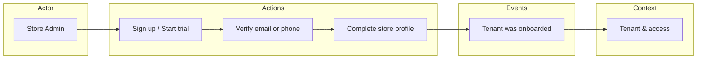
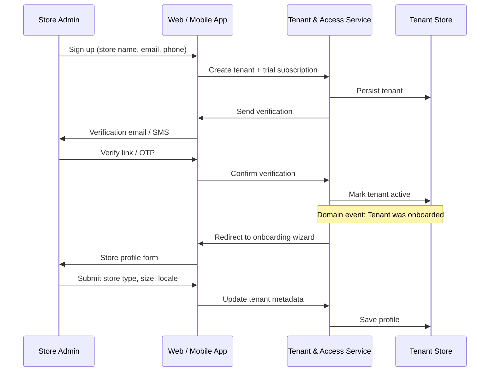
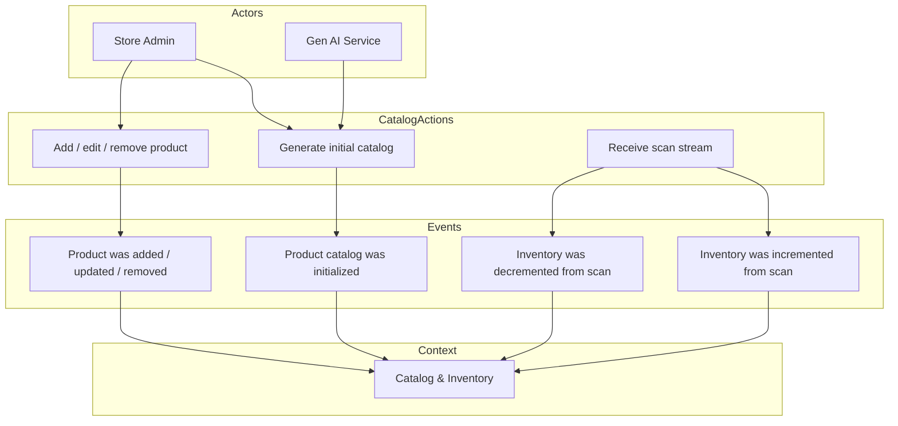
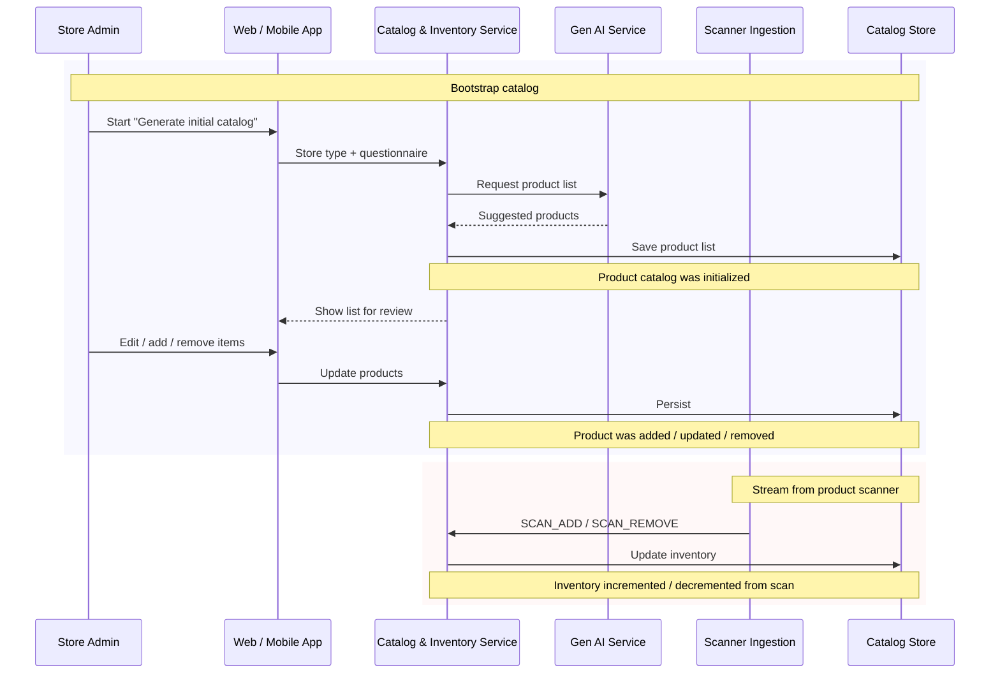
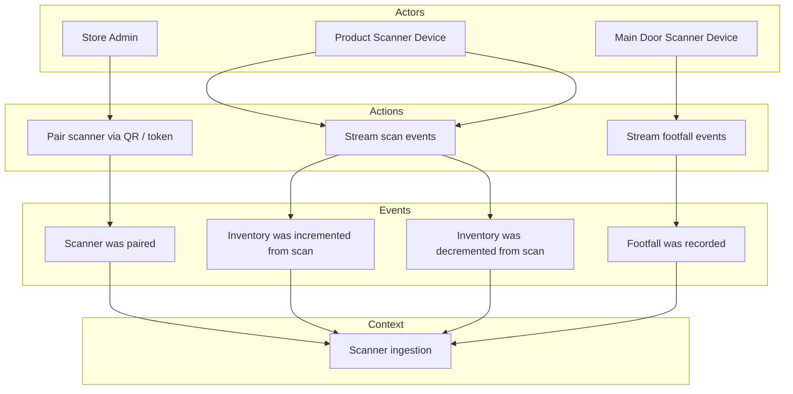
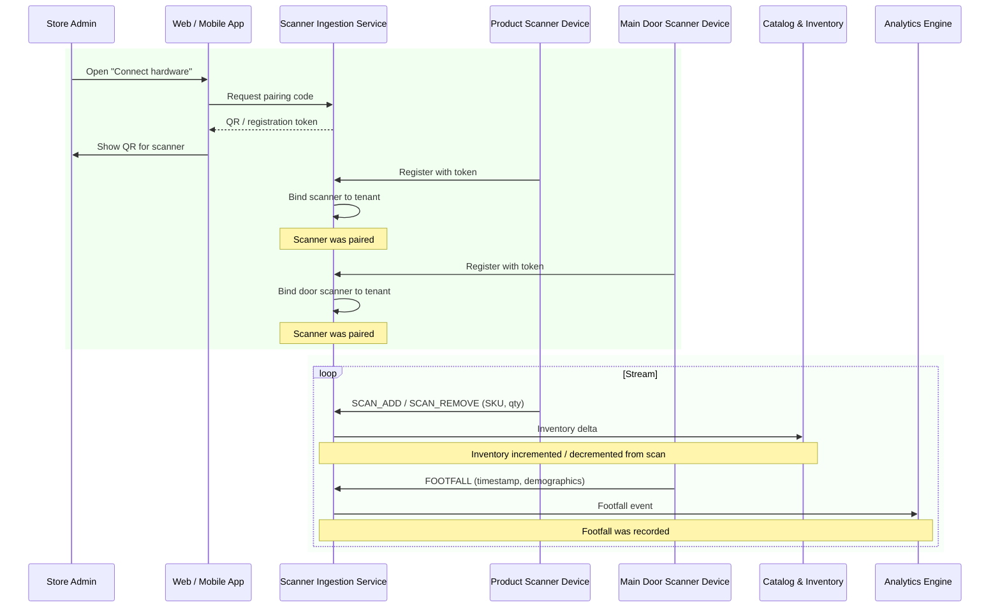
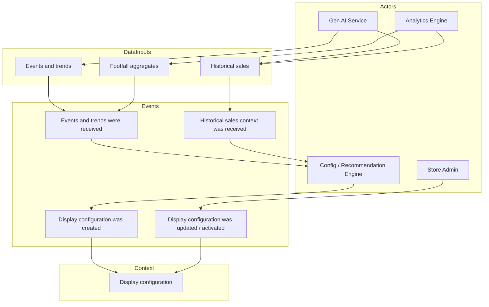
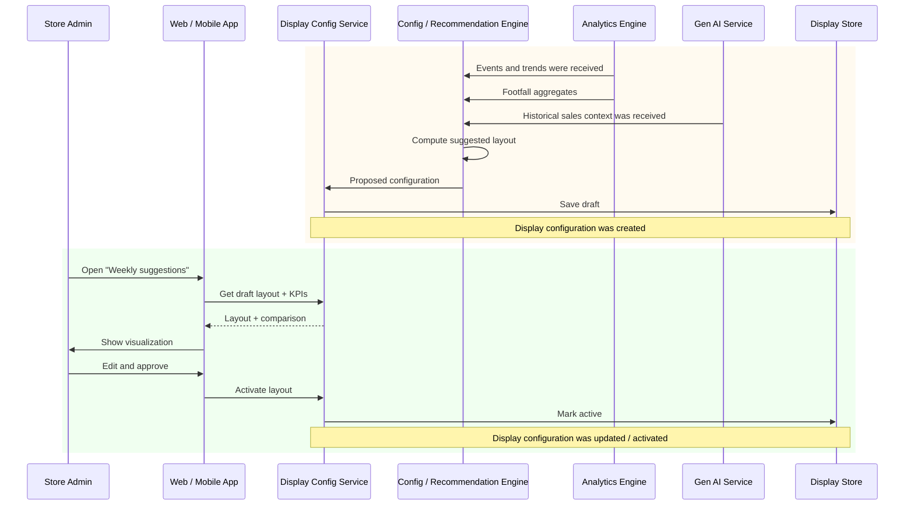
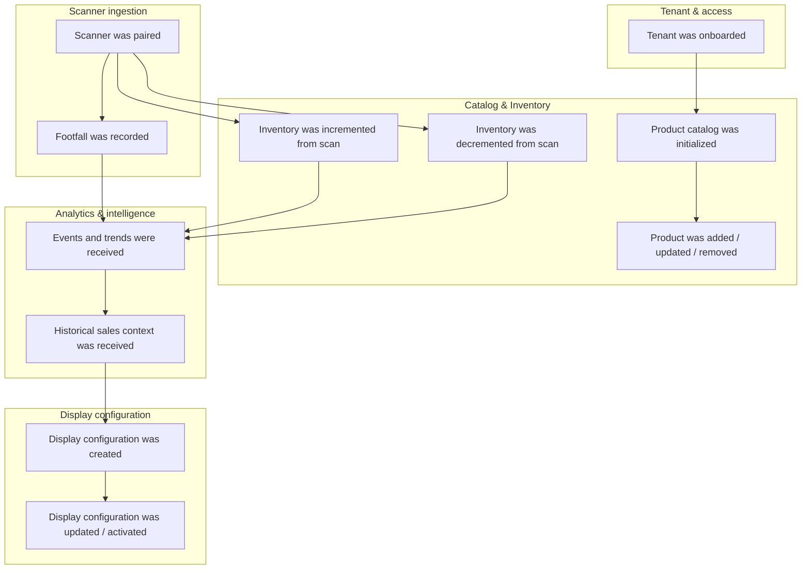

# Event Storming — Retail Store Display Management App

**Traceability:** [docs/01-requirements/requirements.md](../01-requirements/requirements.md)

---

## 1. Actors List

| Actor | Description | Related requirements |
|-------|-------------|----------------------|
| Store Admin | Primary user; maintains products, inventory, scanner pairing, and display configuration via Web/Mobile. | [REQ-F-001], [REQ-F-002]–[REQ-F-010], [REQ-F-012], [REQ-NF-004] |
| Product Scanner Device | External hardware that streams inventory addition/deletion events. | [REQ-F-005], [REQ-F-006], [REQ-NF-008] |
| Main Door Scanner Device | External hardware that streams footfall data (e.g. Male/Female, approximate age). | [REQ-F-007], [REQ-F-008], [REQ-NF-008] |
| Gen AI Service | External service providing product details, initial product lists, events/trends, and historical sales context. | [REQ-F-003], [REQ-F-004], [REQ-F-010], [REQ-NF-003] |
| Configuration / Recommendation Engine | System component (LLM or custom) that proposes display configurations from events, footfall, and sales. | [REQ-F-010] |
| Analytics Engine | Incremental compute (e.g. Feldera) for data pipelines and analytics. | [REQ-NF-009] |
| ERP / CRM (future) | External systems for OEM integration; not critical for first releases. | [REQ-F-014], [REQ-NF-007] |

---

## 2. Domain Events (past-tense)

| Domain event | Description | Related requirements |
|--------------|-------------|----------------------|
| Product catalog was initialized | Initial product list generated from store type and questionnaires (synthetic/Gen AI). | [REQ-F-004] |
| Product was added | New product created; details fully or partially from Gen AI. | [REQ-F-002], [REQ-F-003] |
| Product was updated / removed | Product or inventory CRUD by store admin. | [REQ-F-002] |
| Inventory was incremented from scan | Product scanner stream recorded an inventory addition. | [REQ-F-006] |
| Inventory was decremented from scan | Product scanner stream recorded an inventory deletion. | [REQ-F-006] |
| Scanner was paired | Store admin paired product scanner or main door scanner with the store. | [REQ-F-005], [REQ-F-007] |
| Footfall was recorded | Main door scanner stream recorded a footfall (with optional demographics). | [REQ-F-008] |
| Events and trends were received | Gen AI or pipeline delivered events/trends data for display optimization. | [REQ-F-010] |
| Historical sales context was received | Gen AI or own DB provided historical sales data for configuration. | [REQ-F-010] |
| Display configuration was created | New weekly or ad hoc configuration created (LLM or custom engine). | [REQ-F-009], [REQ-F-010] |
| Display configuration was updated / activated | Store admin edited or activated a display configuration; visualization updated. | [REQ-F-009] |
| Tenant was onboarded | New store/tenant signed up (self-service trial/purchase). | [REQ-F-001], [REQ-F-013], [REQ-NF-006] |

---

## 3. Bounded Contexts Table

| Bounded context | Responsibility | Key domain events | Related requirements |
|-----------------|----------------|-------------------|----------------------|
| **Catalog & Inventory** | Product master data and inventory levels; Gen AI product enrichment; initial catalog generation. | Product catalog was initialized, Product was added/updated/removed, Inventory was incremented/decremented from scan. | [REQ-F-002], [REQ-F-003], [REQ-F-004], [REQ-F-006] |
| **Scanner ingestion** | Pairing and consuming streams from product scanners and main door scanners; normalizing and publishing events. | Scanner was paired, Inventory was incremented/decremented from scan, Footfall was recorded. | [REQ-F-005]–[REQ-F-008], [REQ-NF-008] |
| **Display configuration** | Creating, maintaining, and visualizing store display configurations; consuming events, footfall, and sales context; configuration/recommendation engine. | Events and trends were received, Historical sales context was received, Display configuration was created/updated/activated. | [REQ-F-009], [REQ-F-010], [REQ-NF-009] |
| **Tenant & access** | Multi-tenant identity, tenant onboarding, self-service trial/purchase, and access control. | Tenant was onboarded. | [REQ-F-001], [REQ-F-013], [REQ-NF-006], [ARCH-CHAR-002] |
| **Analytics & intelligence** | Pipelines and incremental computation (e.g. Feldera); aggregation of footfall, sales, and events for display engine. | Events and trends were received, Historical sales context was received (downstream). | [REQ-NF-009] |
| **Integrations (future)** | OEM-friendly APIs and adapters for ERPs and CRMs. | — | [REQ-F-014], [REQ-NF-007] |

---

## 4. Event Flow Diagrams (for PPT)

Flow diagrams below map **actors → actions → domain events** by bounded context. Use Mermaid renderer or export as PNG/SVG for slides.

### 4.1 Tenant onboarding flow

**Actors:** Store Admin · **Event:** Tenant was onboarded

---

### 4.2 Catalog and inventory flow

**Actors:** Store Admin, Gen AI Service · **Events:** Product catalog was initialized; Product was added/updated/removed; Inventory was incremented/decremented from scan

---

### 4.3 Scanner pairing and ingestion flow

**Actors:** Store Admin, Product Scanner Device, Main Door Scanner Device · **Events:** Scanner was paired; Inventory incremented/decremented from scan; Footfall was recorded

---

### 4.4 Display configuration flow

**Actors:** Store Admin, Gen AI Service, Configuration/Recommendation Engine, Analytics Engine · **Events:** Events and trends received; Historical sales context received; Display configuration was created/updated/activated

---

### 4.5 End-to-end event flow (high-level)

Overview of how domain events connect across bounded contexts.

---

### 4.6 Summary table for PPT

| Flow | Diagram section | Main actors | Key events | Bounded context |
|------|-----------------|-------------|------------|-----------------|
| Tenant onboarding | 4.1 | Store Admin | Tenant was onboarded | Tenant & access |
| Catalog & inventory | 4.2 | Store Admin, Gen AI, Product Scanner | Catalog initialized, Product added/updated/removed, Inventory incremented/decremented | Catalog & Inventory |
| Scanner pairing & ingestion | 4.3 | Store Admin, Product Scanner, Door Scanner | Scanner was paired, Inventory events, Footfall was recorded | Scanner ingestion |
| Display configuration | 4.4 | Store Admin, Gen AI, Config Engine, Analytics | Events/trends received, Sales context received, Display created/updated/activated | Display configuration |
| End-to-end | 4.5 | All | All domain events | All contexts |

**Export for PPT:** Render each Mermaid block in a Markdown preview (e.g. VS Code, Cursor, or [Mermaid Live](https://mermaid.live)), then copy as PNG/SVG or use a Mermaid-to-image export tool for slides.

---

*Document generated from problem statement; traceability to [docs/01-requirements/requirements.md](../01-requirements/requirements.md).*
