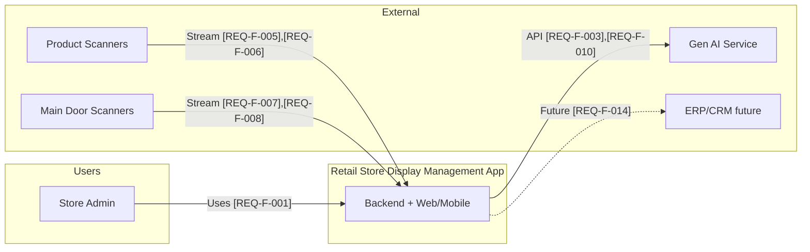
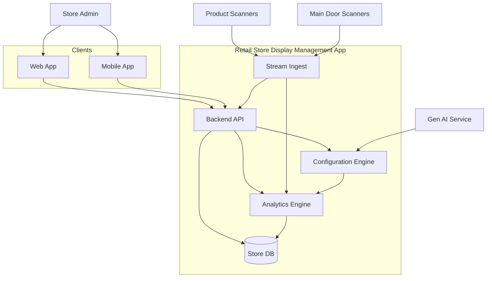
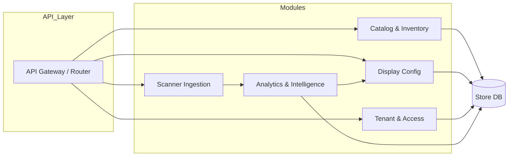
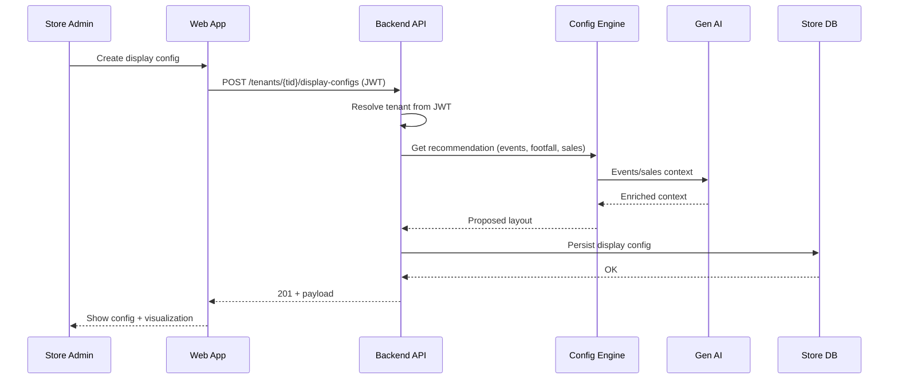
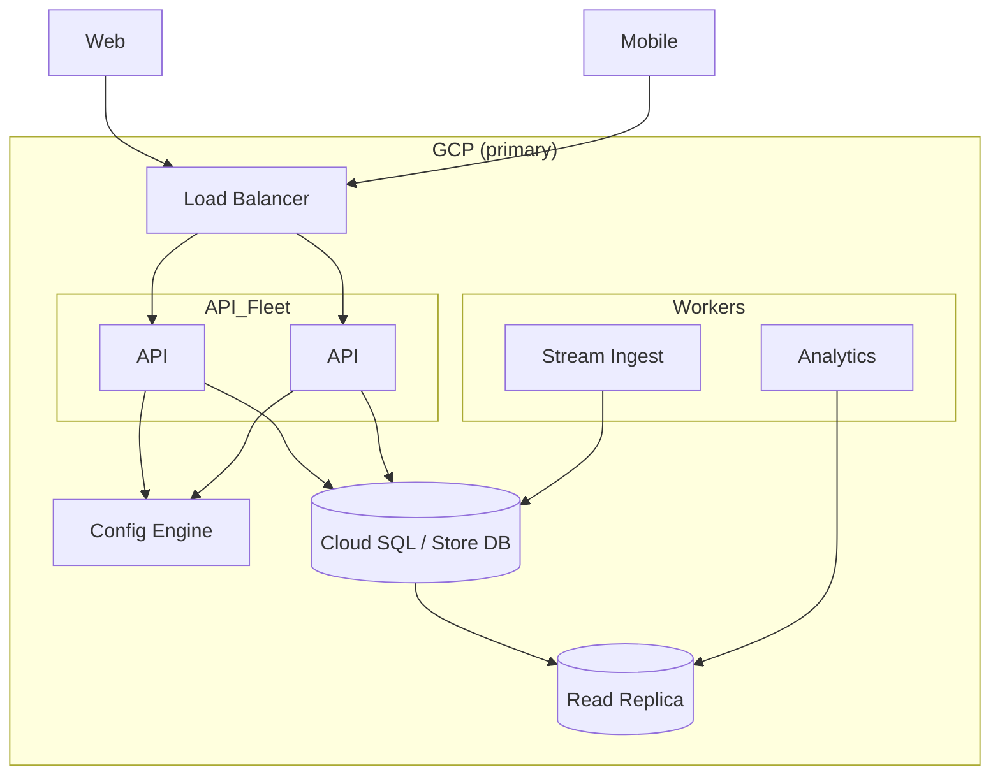

# 01 — Architecture Overview

**Traceability:** [docs/01-requirements/requirements.md](../01-requirements/requirements.md) | [docs/02-discovery/event-storming.md](../02-discovery/event-storming.md)  
**Tags:** [DESIGN-DEC-XXX]

---

## 1. Architecture Style

- **Style:** Modular monolith with event-driven boundaries ([ADR-001](../04-decisions/ADR-001-architecture-style.md)).
- **Rationale:** Balances [ARCH-CHAR-001] Scalability, [ARCH-CHAR-003] Cost efficiency, and [ARCH-CHAR-002] Multi-tenancy.
- **[DESIGN-DEC-001]** All backend capabilities live in one (or few) deployables; internal modules align to bounded contexts (Catalog & Inventory, Scanner ingestion, Display configuration, Tenant & access, Analytics). [REQ-F-001], [REQ-NF-005]
- **[DESIGN-DEC-002]** Scanner and footfall data enter via streams; internal events feed analytics and configuration engine. [REQ-F-006], [REQ-F-008], [REQ-NF-008], [REQ-NF-009]
- **[DESIGN-DEC-003]** Multi-tenancy is in-process: tenant ID in auth and every data access; shared DB with tenant-scoped rows. [REQ-F-001], [ARCH-CHAR-002]

---

## 2. System Context (C1)

Actors and external systems; traceability to requirements.



---

## 3. Container View (C2)

Main runtime containers and their responsibilities.



| Container | Responsibility | Key requirements |
|------------|-----------------|-------------------|
| Web App | Store admin UI; products, inventory, display config, visualization | [REQ-F-002], [REQ-F-009], [REQ-NF-004] |
| Mobile App | Same on Android/iOS | [REQ-F-012] |
| Backend API | Multi-tenant REST/JSON; catalog, inventory, scanners, display config | [REQ-F-006], [REQ-F-008], [REQ-F-010] |
| Stream Ingest | Consume product + footfall streams; publish internal events | [REQ-NF-008] |
| Configuration Engine | Propose display config from events, footfall, sales (LLM/custom) | [REQ-F-010] |
| Analytics Engine | Incremental pipelines (e.g. Feldera) | [REQ-NF-009] |
| Store DB | Products, inventory, display config, tenant data | [REQ-F-002], [ARCH-CHAR-002] |

---

## 4. Module Map (Bounded Contexts → Components)

**[DESIGN-DEC-004]** Backend modules map 1:1 to bounded contexts from event storming for clear boundaries and future extractability.



| Module | Bounded context | Domain events |
|--------|-----------------|---------------|
| Catalog & Inventory | Catalog & Inventory | Product catalog initialized, Product added/updated/removed, Inventory incremented/decremented from scan |
| Scanner Ingestion | Scanner ingestion | Scanner paired, Footfall recorded |
| Display Config | Display configuration | Display configuration created/updated/activated |
| Tenant & Access | Tenant & access | Tenant onboarded |
| Analytics & Intelligence | Analytics & intelligence | Events/trends received, Historical sales context received |

*Ref: [event-storming.md](../02-discovery/event-storming.md) § Bounded Contexts.*

---

## 5. Data Flow (Key Paths)

**[DESIGN-DEC-005]** All API requests are tenant-scoped via `X-Tenant-Id` or JWT claim; Stream Ingest tags events with tenant from device/store pairing. [REQ-F-001], [ARCH-CHAR-002]



---

## 6. Key Endpoint — Create Display Configuration

Supports [REQ-F-009], [REQ-F-010]: store admin creates a new display configuration (weekly or ad hoc); system may use events, footfall, and historical sales (Gen AI or own DB).

**Endpoint:** `POST /api/v1/tenants/{tenantId}/display-configs`

**Headers:** `Authorization: Bearer <JWT>`, `Content-Type: application/json`  
**[DESIGN-DEC-006]** Tenant is derived from JWT or path; path `tenantId` must match authenticated tenant. [ARCH-CHAR-002]

### Request body (example)

```json
{
  "name": "Week 12 — Festival promo",
  "schedule": "weekly",
  "effectiveFrom": "2025-03-17T00:00:00Z",
  "useRecommendation": true,
  "sources": {
    "eventsAndTrends": true,
    "footfallLastWeek": true,
    "historicalSales": "own_db"
  },
  "zones": [
    {
      "zoneId": "entrance-left",
      "productIds": ["prod-001", "prod-002"],
      "layoutHint": "front-facing"
    }
  ]
}
```

### Response 201 (example)

```json
{
  "id": "dc-550e8400-e29b-41d4-a716-446655440000",
  "tenantId": "tenant-abc123",
  "name": "Week 12 — Festival promo",
  "schedule": "weekly",
  "effectiveFrom": "2025-03-17T00:00:00Z",
  "status": "draft",
  "recommendationUsed": true,
  "zones": [
    {
      "zoneId": "entrance-left",
      "productIds": ["prod-001", "prod-002"],
      "layoutHint": "front-facing"
    }
  ],
  "createdAt": "2025-03-02T10:15:00Z",
  "updatedAt": "2025-03-02T10:15:00Z"
}
```

| Field | Description |
|-------|-------------|
| `useRecommendation` | If true, Configuration Engine uses events, footfall, sales to propose/refine layout. [REQ-F-010] |
| `sources.eventsAndTrends` | Include Gen AI / pipeline events and trends. |
| `sources.footfallLastWeek` | Include last week footfall for placement. [REQ-F-008] |
| `sources.historicalSales` | `"own_db"` or `"gen_ai"`. [REQ-F-010] |
| `zones` | Optional override; if empty and `useRecommendation` true, engine proposes zones. |

---

## 7. Deployment View (Logical)

**[DESIGN-DEC-007]** GCP-first; API and Stream Ingest are stateless and horizontally scalable; Store DB uses managed RDBMS with read replicas as needed. [REQ-NF-001], [REQ-NF-005]



---

## 8. Design Decisions Summary

| ID | Decision | Traceability |
|----|----------|--------------|
| [DESIGN-DEC-001] | Modular monolith; modules = bounded contexts | [REQ-F-001], [REQ-NF-005], ADR-001 |
| [DESIGN-DEC-002] | Event-driven boundaries for streams and analytics | [REQ-F-006], [REQ-F-008], [REQ-NF-008], [REQ-NF-009] |
| [DESIGN-DEC-003] | In-process multi-tenancy; tenant ID in auth and data | [REQ-F-001], [ARCH-CHAR-002] |
| [DESIGN-DEC-004] | Backend modules map to event-storming bounded contexts | docs/02-discovery/event-storming.md |
| [DESIGN-DEC-005] | Tenant-scoped API and stream events | [REQ-F-001], [ARCH-CHAR-002] |
| [DESIGN-DEC-006] | Tenant from JWT; path tenantId must match | [ARCH-CHAR-002] |
| [DESIGN-DEC-007] | GCP-first; stateless API/workers; managed DB + replicas | [REQ-NF-001], [REQ-NF-005] |

---

*Links: [requirements](../01-requirements/requirements.md) | [event-storming](../02-discovery/event-storming.md) | [ADR-001](../04-decisions/ADR-001-architecture-style.md) | [C1 diagram](../../diagrams/context-c1.mmd) | [C2 diagram](../../diagrams/container-c2.mmd)*
