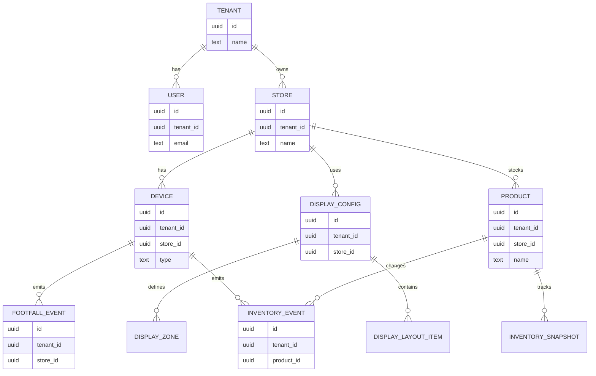

## 02 — Data Model & DB Design

**Traceability:** [requirements](../01-requirements/requirements.md) · [event-storming](../02-discovery/event-storming.md) · [architecture overview](./01-architecture-overview.md)  
**Tags:** [DESIGN-DEC-010] [REQ] [ADR]

---

## 1. Goals & Constraints [REQ]

- **Multi-tenancy:** Shared database with strict tenant scoping for all rows ([DESIGN-DEC-003], [ARCH-CHAR-002]).  
- **Modular monolith alignment:** Tables grouped by bounded context (Catalog & Inventory, Scanner ingestion, Display configuration, Tenant & access, Analytics).  
- **Cost efficiency:** Prefer a single relational store (e.g., Cloud SQL/Postgres) with append-only event tables where needed; avoid early over-sharding.  
- **Analytics:** Support incremental compute engine (e.g., Feldera) via append-only event tables and materialized views ([REQ-NF-009]).  

---

## 2. High-Level Entity Map [REQ]

### 2.1 Mermaid ER overview (renders in Markdown)



### 2.2 DBML source (for dbdiagram.io)

The same schema is expressed in **DBML** so it can be imported into tools like `dbdiagram.io`.

```dbml
Project retail_display_app {
  database_type: "PostgreSQL"
}

Table tenants {
  id uuid [pk]
  name varchar(150)
  slug varchar(80)
  status varchar(32)
  plan varchar(64)
  default_locale varchar(10)
  created_at timestamptz
  updated_at timestamptz
}

Table users {
  id uuid [pk]
  tenant_id uuid [not null, ref: > tenants.id]
  email varchar(255)
  display_name varchar(150)
  role varchar(32)
  is_active boolean
  created_at timestamptz
  updated_at timestamptz
}

Table stores {
  id uuid [pk]
  tenant_id uuid [not null, ref: > tenants.id]
  name varchar(150)
  type varchar(64)
  city varchar(100)
  country varchar(50)
  timezone varchar(50)
  area_sq_ft int
  created_at timestamptz
  updated_at timestamptz
}

Table product_categories {
  id uuid [pk]
  tenant_id uuid [not null, ref: > tenants.id]
  name varchar(150)
  parent_id uuid [ref: > product_categories.id]
}

Table products {
  id uuid [pk]
  tenant_id uuid [not null, ref: > tenants.id]
  store_id uuid [not null, ref: > stores.id]
  external_sku varchar(64)
  name varchar(255)
  description text
  category_id uuid [ref: > product_categories.id]
  price numeric(12,2)
  unit varchar(32)
  source varchar(32)
  is_active boolean
  created_at timestamptz
  updated_at timestamptz
}

Table devices {
  id uuid [pk]
  tenant_id uuid [not null, ref: > tenants.id]
  store_id uuid [not null, ref: > stores.id]
  device_type varchar(32)
  name varchar(150)
  status varchar(32)
  last_seen_at timestamptz
  created_at timestamptz
}

Table inventory_events {
  id uuid [pk]
  tenant_id uuid [not null, ref: > tenants.id]
  store_id uuid [not null, ref: > stores.id]
  product_id uuid [not null, ref: > products.id]
  device_id uuid [ref: > devices.id]
  event_type varchar(32)
  quantity int
  occurred_at timestamptz
  ingested_at timestamptz
}

Table inventory_snapshots {
  id uuid [pk]
  tenant_id uuid [not null, ref: > tenants.id]
  store_id uuid [not null, ref: > stores.id]
  product_id uuid [not null, ref: > products.id]
  quantity_on_hand int
  as_of timestamptz
}

Table footfall_events {
  id uuid [pk]
  tenant_id uuid [not null, ref: > tenants.id]
  store_id uuid [not null, ref: > stores.id]
  device_id uuid [not null, ref: > devices.id]
  gender varchar(16)
  age_bucket varchar(16)
  entered_at timestamptz
  ingested_at timestamptz
}

Table display_zones {
  id uuid [pk]
  tenant_id uuid [not null, ref: > tenants.id]
  store_id uuid [not null, ref: > stores.id]
  code varchar(64)
  name varchar(150)
  description text
  created_at timestamptz
}

Table display_configs {
  id uuid [pk]
  tenant_id uuid [not null, ref: > tenants.id]
  store_id uuid [not null, ref: > stores.id]
  name varchar(200)
  schedule varchar(32)
  status varchar(32)
  effective_from timestamptz
  effective_to timestamptz
  use_recommendation boolean
  sources_events_trends boolean
  sources_footfall_last_week boolean
  sources_historical_sales varchar(16)
  created_by uuid [ref: > users.id]
  created_at timestamptz
  updated_at timestamptz
}

Table display_layout_items {
  id uuid [pk]
  display_config_id uuid [not null, ref: > display_configs.id]
  zone_id uuid [not null, ref: > display_zones.id]
  product_id uuid [ref: > products.id]
  category_id uuid [ref: > product_categories.id]
  position_index int
  layout_hint varchar(64)
}

Ref: stores.tenant_id > tenants.id
Ref: devices.store_id > stores.id
Ref: products.store_id > stores.id
Ref: inventory_events.product_id > products.id
Ref: inventory_events.device_id > devices.id
Ref: footfall_events.device_id > devices.id
Ref: display_zones.store_id > stores.id
Ref: display_configs.store_id > stores.id
Ref: display_layout_items.zone_id > display_zones.id
Ref: display_layout_items.display_config_id > display_configs.id
```

> **[DESIGN-DEC-010]** Every multi-tenant table includes `tenant_id` (and usually `store_id`) as part of the primary or composite key for row-level isolation. The Mermaid ER should render in Markdown previews; the DBML can be copied directly into `dbdiagram.io` or used as a `.dbml` source file.

---

## 3. Tenant & Access Context [REQ]

### 3.1 Core tables

| Table | Key columns | Purpose |
|-------|------------|---------|
| `tenants` | `id` | Logical tenant (business customer). |
| `users` | `id`, `tenant_id` | Admin and future roles within a tenant. |
| `stores` | `id`, `tenant_id` | Physical stores/locations under a tenant. |
| `auth_identities` | `id`, `tenant_id`, `user_id` | Mapping to identity provider / credentials. |

#### `tenants`

| Column | Type | Notes |
|--------|------|-------|
| `id` | `uuid` (PK) | Tenant identifier, used in JWT claims. |
| `name` | `varchar(150)` | Display name. |
| `slug` | `varchar(80)` | URL-safe key, optional. |
| `status` | `varchar(32)` | `trial`, `active`, `suspended`, `closed`. |
| `plan` | `varchar(64)` | Pricing tier. |
| `default_locale` | `varchar(10)` | e.g. `en-IN`. [REQ-F-011] |
| `created_at` | `timestamptz` | Audit. |
| `updated_at` | `timestamptz` | Audit. |

#### `users`

| Column | Type | Notes |
|--------|------|-------|
| `id` | `uuid` (PK) | User identifier. |
| `tenant_id` | `uuid` (FK → `tenants.id`) | Tenant scope. |
| `email` | `varchar(255)` | Login name, unique per tenant. |
| `display_name` | `varchar(150)` | For UI. |
| `role` | `varchar(32)` | `admin` (MVP), future `staff`. |
| `is_active` | `boolean` | Soft-disable. |
| `created_at` | `timestamptz` |  |
| `updated_at` | `timestamptz` |  |

#### `stores`

| Column | Type | Notes |
|--------|------|-------|
| `id` | `uuid` (PK) | Store/location. |
| `tenant_id` | `uuid` (FK → `tenants`) | Tenant scope. |
| `name` | `varchar(150)` | Store name. |
| `type` | `varchar(64)` | Grocery, pharmacy, etc. (drives templates). |
| `city` | `varchar(100)` |  |
| `country` | `varchar(50)` |  |
| `timezone` | `varchar(50)` |  |
| `area_sq_ft` | `int` | Optional. |
| `created_at` | `timestamptz` |  |
| `updated_at` | `timestamptz` |  |

---

## 4. Catalog & Inventory Context [REQ]

### 4.1 Tables

| Table | Key columns | Purpose |
|-------|------------|---------|
| `product_categories` | `id`, `tenant_id` | Logical grouping of products. |
| `products` | `id`, `tenant_id`, `store_id` | Individual SKUs (real or synthetic). |
| `product_ai_metadata` | `product_id` | AI prompts/results for traceability. |
| `inventory_snapshots` | `id`, `tenant_id`, `product_id`, `as_of` | Current/point-in-time inventory. |
| `inventory_events` | `id`, `tenant_id`, `product_id` | Append-only inventory deltas from scanners. |

#### `products`

| Column | Type | Notes |
|--------|------|-------|
| `id` | `uuid` (PK) | Product ID. |
| `tenant_id` | `uuid` (FK → `tenants`) |  |
| `store_id` | `uuid` (FK → `stores`) | Store-specific assortment. |
| `external_sku` | `varchar(64)` | Optional ERP SKU. |
| `name` | `varchar(255)` | Product name. |
| `description` | `text` |  |
| `category_id` | `uuid` (FK → `product_categories`) |  |
| `price` | `numeric(12,2)` | Current price. |
| `unit` | `varchar(32)` | `pcs`, `kg`, etc. |
| `source` | `varchar(32)` | `manual`, `gen_ai`, `generated_template`. |
| `is_active` | `boolean` | Soft-delete. |
| `created_at` | `timestamptz` |  |
| `updated_at` | `timestamptz` |  |

#### `inventory_events`

Event-sourced inventory from product scanners.

| Column | Type | Notes |
|--------|------|-------|
| `id` | `uuid` (PK) | Event ID. |
| `tenant_id` | `uuid` | For partitioning; indexed. |
| `store_id` | `uuid` |  |
| `product_id` | `uuid` |  |
| `device_id` | `uuid` (FK → `devices`) | Which scanner. |
| `event_type` | `varchar(32)` | `increment`, `decrement`, `adjustment`. |
| `quantity` | `int` | Positive; sign implied by `event_type`. |
| `occurred_at` | `timestamptz` | Event time from device. |
| `ingested_at` | `timestamptz` | Server ingest time. |

#### `inventory_snapshots`

Materialized current stock per product for fast reads.

| Column | Type | Notes |
|--------|------|-------|
| `id` | `uuid` (PK) | Snapshot row. |
| `tenant_id` | `uuid` |  |
| `store_id` | `uuid` |  |
| `product_id` | `uuid` |  |
| `quantity_on_hand` | `int` |  |
| `as_of` | `timestamptz` | Last updated. |

---

## 5. Scanner Ingestion Context [REQ]

### 5.1 Tables

| Table | Key columns | Purpose |
|-------|------------|---------|
| `devices` | `id`, `tenant_id`, `store_id` | Registered scanners (product / door). |
| `device_pairing_tokens` | `id`, `tenant_id`, `device_id` | Short-lived pairing codes. |
| `footfall_events` | `id`, `tenant_id`, `store_id` | Raw footfall stream from door scanners. |

#### `devices`

| Column | Type | Notes |
|--------|------|-------|
| `id` | `uuid` (PK) | Device ID. |
| `tenant_id` | `uuid` |  |
| `store_id` | `uuid` |  |
| `device_type` | `varchar(32)` | `product_scanner`, `door_scanner`. |
| `name` | `varchar(150)` | Friendly label. |
| `status` | `varchar(32)` | `pending`, `active`, `inactive`. |
| `last_seen_at` | `timestamptz` | Heartbeat. |
| `created_at` | `timestamptz` |  |

#### `footfall_events`

| Column | Type | Notes |
|--------|------|-------|
| `id` | `uuid` (PK) | Event ID. |
| `tenant_id` | `uuid` | Partition. |
| `store_id` | `uuid` |  |
| `device_id` | `uuid` | Door scanner. |
| `gender` | `varchar(16)` | Optional, e.g. `male`, `female`, `unknown`. |
| `age_bucket` | `varchar(16)` | e.g. `18-25`, `26-35`, or `unknown`. |
| `entered_at` | `timestamptz` | Time of footfall. |
| `ingested_at` | `timestamptz` | Server time. |

---

## 6. Display Configuration Context [REQ]

### 6.1 Tables

| Table | Key columns | Purpose |
|-------|------------|---------|
| `display_zones` | `id`, `tenant_id`, `store_id` | Named physical zones (entrance, aisle, checkout). |
| `display_configs` | `id`, `tenant_id`, `store_id` | Weekly/ad-hoc display configurations. |
| `display_layout_items` | `id`, `display_config_id` | Placement of products/categories within a layout. |
| `display_config_events` | `id`, `display_config_id` | Audit trail of create/update/activate events. |

#### `display_zones`

| Column | Type | Notes |
|--------|------|-------|
| `id` | `uuid` (PK) | Zone ID. |
| `tenant_id` | `uuid` |  |
| `store_id` | `uuid` |  |
| `code` | `varchar(64)` | `entrance-left`, `checkout-1`, etc. |
| `name` | `varchar(150)` | Human-readable label. |
| `description` | `text` | Optional. |
| `created_at` | `timestamptz` |  |

#### `display_configs`

| Column | Type | Notes |
|--------|------|-------|
| `id` | `uuid` (PK) | Config ID. |
| `tenant_id` | `uuid` |  |
| `store_id` | `uuid` |  |
| `name` | `varchar(200)` | e.g., `Week 12 — Festival promo`. |
| `schedule` | `varchar(32)` | `weekly`, `one_off`. |
| `status` | `varchar(32)` | `draft`, `active`, `archived`, `rejected`. |
| `effective_from` | `timestamptz` | Start date. |
| `effective_to` | `timestamptz` | Optional end. |
| `use_recommendation` | `boolean` | Whether engine/LLM was used. |
| `sources_events_trends` | `boolean` | Input flag. |
| `sources_footfall_last_week` | `boolean` | Input flag. |
| `sources_historical_sales` | `varchar(16)` | `own_db`, `gen_ai`, `none`. |
| `created_by` | `uuid` (FK → `users`) |  |
| `created_at` | `timestamptz` |  |
| `updated_at` | `timestamptz` |  |

#### `display_layout_items`

 | Column | Type | Notes |
 |--------|------|-------|
 | `id` | `uuid` (PK) | Item row. |
 | `display_config_id` | `uuid` (FK → `display_configs`) |  |
 | `zone_id` | `uuid` (FK → `display_zones`) |  |
 | `product_id` | `uuid` (FK → `products`) | Single SKU; or nullable for category-based zone. |
 | `category_id` | `uuid` (FK → `product_categories`) | Optional category group. |
 | `position_index` | `int` | For ordering in UI. |
 | `layout_hint` | `varchar(64)` | `front-facing`, `end-cap`, etc. |

---

## 7. Analytics & Intelligence Context [REQ]

The analytics engine (e.g., Feldera) will primarily consume:

- `inventory_events`  
- `footfall_events`  
- `display_configs` and `display_layout_items`  

and output **materialized views** such as:

- `mv_zone_performance_daily` (zone-level KPIs)  
- `mv_product_performance_weekly` (product-level KPIs by layout)  

These can be implemented as:

- SQL views backed by incremental engine, or  
- Separate analytics store keyed by `tenant_id`, `store_id`, time grain.

Detailed schema for these views can be refined once the analytics engine is chosen and wired in.

---

## 8. Multi-Tenancy & Indexing [ADR]

- **Row-level scoping:** Every main table includes `tenant_id`, and most queries filter by it.  
- **Composite indexes:**  
  - `ON products(tenant_id, store_id, category_id)`  
  - `ON inventory_events(tenant_id, store_id, occurred_at)`  
  - `ON footfall_events(tenant_id, store_id, entered_at)`  
  - `ON display_configs(tenant_id, store_id, status, effective_from)`  
- **Isolation:** Application layer ensures authenticated `tenant_id` matches row `tenant_id` ([DESIGN-DEC-005], [DESIGN-DEC-006]); DB can add RLS (Row-Level Security) later as an ADR if needed.

---

*This DB design is intentionally logical; physical tuning (partitioning, sharding, RLS) should be captured in follow-up ADRs once load patterns are clearer.*

