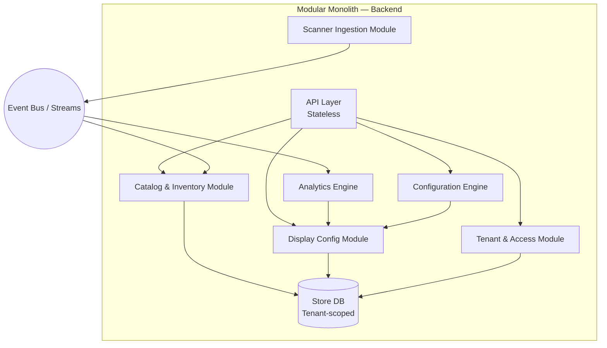

# ADR-001: Architecture Style

**Title:** Why we chose Modular Monolith with event-driven boundaries  
**Tags:** [ADR], [DECISION]

---

## Status

**Accepted** — Applies to initial design and POC; may be revisited at scale (e.g. post–Series A) if extraction of services is justified.

---

## Context

The Retail Store Display Management App is a multi-tenant B2B SaaS with Web and Mobile front ends, streaming ingestion (product scanners, main door footfall), Gen AI integration, and an analytics/configuration engine. The **Top 3 Architecture Characteristics** from [requirements.md](../01-requirements/requirements.md) drive the architecture choice:

| Rank | ID | Characteristic | Implication |
|------|----|----------------|-------------|
| 1 | [ARCH-CHAR-001] | **Scalability** | Must support 100 → 10,000 tenants and future international expansion without re-architecture; elastic scaling and capacity planning required. |
| 2 | [ARCH-CHAR-003] | **Cost efficiency** | Price-sensitive small stores; low-cost trials and sustainable unit economics; constrains infra and ops spend. |
| 3 | [ARCH-CHAR-002] | **Multi-tenancy** | SaaS foundation; tenant isolation, shared infra, and tenant-aware data/auth from day one. |

We need an architecture style that: (1) scales horizontally where it matters (API, stream ingest, analytics), (2) keeps infra and operational cost low, and (3) embeds multi-tenancy cleanly. Full microservices would favor scalability and isolation but increase cost and operational complexity; a single monolithic deployable would favor cost but risk scaling and coupling. A **modular monolith** with **event-driven boundaries** for streaming and analytics offers a middle path aligned with all three characteristics.

---

## Decision

We choose **Modular Monolith** as the primary architecture style, with **event-driven / stream-processing** used at the boundaries where data enters (scanner streams, footfall) and where heavy computation happens (analytics, configuration engine).

- **Modular monolith:** One (or few) deployable backend(s) with clear internal modules aligned to bounded contexts (Catalog & Inventory, Scanner ingestion, Display configuration, Tenant & access, Analytics). Shared database with tenant-scoped schema or tenant ID on all tables. API layer is stateless and horizontally scalable; stream ingest and analytics can be separate processes or workers within the same logical system.
- **Event-driven boundaries:** Scanner and footfall data are consumed via streams; internal events (e.g. inventory updated, footfall recorded) feed the analytics engine and configuration engine. This keeps ingestion and analytics decoupled and independently scalable without introducing a full microservices mesh.
- **Multi-tenancy:** Implemented inside the monolith via tenant context (e.g. tenant ID in auth token and in every query), tenant-scoped data access, and shared infra. No separate deployment per tenant.

This choice is justified by the Top 3:

1. **Scalability [ARCH-CHAR-001]:** Stateless API and stream workers scale out; database scales via read replicas and tenant-based partitioning if needed. Event-driven boundaries allow scaling ingest and analytics independently. Avoids a single bottleneck without the cost of many small services.
2. **Cost efficiency [ARCH-CHAR-003]:** Fewer moving parts than microservices; shared DB and single (or few) deployment pipeline; managed platform (e.g. GCP) for compute and DB. Gen AI and analytics costs remain controllable at the boundary (caching, batch, usage limits).
3. **Multi-tenancy [ARCH-CHAR-002]:** Single codebase and data model make tenant isolation and fair usage easier to implement and verify. Tenant boundaries are explicit in modules and data; no distributed tenant routing or per-tenant services.

---

## Component view (Mermaid)

High-level component structure inside the backend boundary, showing modular monolith with event-driven links:

---

## Consequences

### Positive

- **Aligns with Top 3:** Delivers scalability (stateless API + scalable workers), cost efficiency (shared infra, few deployments), and multi-tenancy (single codebase, explicit tenant context).
- **Simpler operations:** One (or few) deployables; easier monitoring, debugging, and rollout than a large microservices set.
- **Clear module boundaries:** Bounded contexts (see [event-storming.md](../02-discovery/event-storming.md)) map to modules; easier to extract services later if needed.
- **Portability:** Modular monolith can run on GCP, Azure, or AWS with minimal change; supports [REQ-NF-001] and [ARCH-CHAR-006].

### Negative

- **Scaling is coarser:** Cannot scale a single tiny capability in isolation; we scale API, ingest, or analytics as units.
- **Deployment coupling:** Backend changes deploy together; requires discipline (feature flags, compatibility) to avoid big-bang releases.
- **Future extraction:** If we later need independent scaling or lifecycle for a module, we must extract it into a service and introduce APIs/events; the modular structure reduces but does not eliminate that cost.

---

## Links

- [docs/01-requirements/requirements.md](../01-requirements/requirements.md) — Top 3 characteristics (Section 3.2), [ARCH-CHAR-001], [ARCH-CHAR-002], [ARCH-CHAR-003]
- [docs/02-discovery/event-storming.md](../02-discovery/event-storming.md) — Bounded contexts and domain events
- [diagrams/container-c2.mmd](../../diagrams/container-c2.mmd) — Container diagram (C2)
