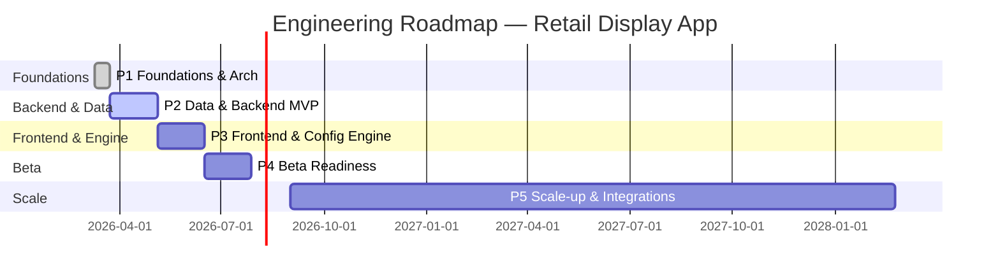

## Engineering & Development Roadmap

**Project:** Retail Store Display Management App  
**Traceability:** [REQ] → `docs/01-requirements/requirements.md` · [ARCH] → `docs/03-design/01-architecture-overview.md` · [MVP] → `docs/05-presentation/mvp-roadmap.md`  
**Tags:** [REQ] [RISK] [POC] [DECISION]

---

## 1. Scope & Assumptions [REQ]

| Item | Description |
|------|-------------|
| **Scope** | Engineering roadmap from post-architecture sign-off through Beta and scale-up, aligned with `mvp-roadmap.md`. |
| **Stack baseline [DECISION]** | Backend as modular monolith on relational DB (Postgres/Cloud SQL); GCP-first deployment with cloud-agnostic patterns. |
| **Clients** | Web (primary admin UI) and Mobile (Android/iOS) consuming REST/JSON APIs. |
| **AI usage** | External Gen AI provider via API, with spend guards and metrics. [REQ-NF-003] |

---

## 2. Phase Overview (Engineering View) [REQ]

This view mirrors `mvp-roadmap.md` but focuses on engineering outputs.

| Phase | Timeframe | Engineering Focus | Primary Tracks |
|-------|-----------|-------------------|----------------|
| **P1. Foundations & Architecture Hardening** | Weeks 1–2 | Finalize architecture, bootstrap repo, CI/CD, core scaffolding | Platform, Auth & Tenancy, DevEx |
| **P2. Data & Backend MVP** | Weeks 3–8 | Multi-tenant API, DB schema, scanner & footfall ingest, analytics plumbing | Backend/API, DB, Streaming, Analytics |
| **P3. Frontend & Config Engine** | Weeks 9–14 | Web + Mobile UIs, display config flows, Gen AI/config engine | Web, Mobile, Config Engine, UX |
| **P4. Beta Readiness & GTM Tech** | Weeks 15–20 | Self-service onboarding, trials, monitoring, cost controls | Auth & Billing, DevOps, Observability |
| **P5. Scale-up & Extensibility** | Months 6–24 | Performance, multi-language, ERP/CRM hooks, portability | Scale, Internationalization, Integrations, SLOs |

---

## 3. Tracks & Responsibilities [REQ]

| Track ID | Name | Responsibility |
|----------|------|----------------|
| **T1** | Platform & DevEx | Repo structure, CI/CD, environments, feature flags, quality gates. |
| **T2** | Auth, Tenancy & Access | Tenant/user model, auth, RBAC, tenant isolation, self-service onboarding. |
| **T3** | Catalog & Inventory Backend | Product CRUD, inventory events/snapshots, Gen-AI-assisted product creation. |
| **T4** | Scanner & Footfall Ingest | Device management, streaming ingestion, synthetic data for POCs. |
| **T5** | Display Configuration & Engine | Display config CRUD, visualization backend, recommendation engine (Gen AI / rules). |
| **T6** | Web Frontend | Store admin web app (golden path flows). |
| **T7** | Mobile Apps | Android/iOS companions for scanning and basic operations. |
| **T8** | Analytics & Reporting | Pipelines, materialized views, KPIs, dashboards. |
| **T9** | DevOps, Observability & Cost Controls | Infra as code, monitoring, SLOs, cloud & Gen AI budget guards. |

---

## 4. Phase-by-Phase Engineering Plan [REQ]

### 4.1 P1 — Foundations & Architecture Hardening (Weeks 1–2)

| Track | Objectives | Key Epics / Stories | Exit Criteria |
|-------|------------|---------------------|---------------|
| **T1 Platform & DevEx** | Ready-to-code baseline | Repo structure, branch strategy, code style; CI (build + unit tests); basic linting/formatting; environment configs (dev/stage/prod). | CI green for sample service; one-click deploy to dev. |
| **T2 Auth & Tenancy** | Tenant-aware skeleton | Implement `tenants`, `users`, `stores` per data model; JWT-based auth stub; tenant resolution middleware. | Sample API `/tenants/{id}/stores` enforcing tenant scope. |
| **T3 Catalog & Inventory** | Schema & API stubs | DB migrations for `products`, `inventory_events`, `inventory_snapshots`; minimal CRUD APIs (no UI yet). | CRUD works via API client; migrations automated in CI/CD. |
| **T9 DevOps & Observability** | Basic visibility | Centralized logging, request IDs, basic metrics (latency, error rate). | Dashboards for dev/stage; log correlation by request ID. |

- **[RISK]** Over-architecting early; keep P1 minimal to unblock P2.  
- **[POC]** Small spike on JWT + tenant resolution to validate middleware and DB patterns.

---

### 4.2 P2 — Data & Backend MVP (Weeks 3–8)

| Track | Objectives | Key Epics / Stories | Exit Criteria |
|-------|------------|---------------------|---------------|
| **T3 Catalog & Inventory** | Usable product & inventory APIs | Full CRUD with validation; inventory event ingestion and snapshot update jobs; Gen AI metadata table for products. | Tenant can manage products and see inventory via APIs only. |
| **T4 Scanner & Footfall Ingest** | Stream ingestion path | Device registration & pairing; HTTP/gRPC ingestion endpoints for product and door scanners; synthetic data generators for both streams. | Synthetic streams flowing into `inventory_events` & `footfall_events` with visible metrics. |
| **T8 Analytics & Reporting** | Analytics plumbing | Integrate incremental compute engine (e.g., Fellera) or equivalent; define 1–2 materialized views (`mv_zone_performance_daily`, `mv_product_performance_weekly`). | Simple query over analytics views works in dev; latency within agreed bounds. |
| **T2 Auth & Tenancy** | Harden multi-tenancy | Enforce tenant filters in all MVP queries; composite indexes from data-model doc; basic admin vs. future role support. | Tenant isolation proven by tests and manual verification. |
| **T9 DevOps & Observability** | Backend health | Health endpoints; golden signal dashboards (RPS, latency, errors, saturation). | P90/P99 monitoring in place; alerting on error spikes. |

- **[RISK]** Stream/analytics complexity and resource usage.  
- **[POC]** Build an end-to-end “scanner → event → analytics view” spike early in P2 to derisk.

---

### 4.3 P3 — Frontend & Config Engine (Weeks 9–14)

| Track | Objectives | Key Epics / Stories | Exit Criteria |
|-------|------------|---------------------|---------------|
| **T6 Web Frontend** | Admin UI covering golden paths | Authenticated web shell; views for products, inventory, devices; display config creation & visualization; usability tuned for non-technical admins. [REQ-NF-004] | Store admin can follow the golden path (`golden-path.md`) without API tools. |
| **T5 Display Config & Engine** | Weekly/ad hoc display config | APIs for `display_configs`, `display_zones`, `display_layout_items`; engine that takes events, footfall, sales and proposes layouts (LLM or rules); audit trail. | API `POST /display-configs` + UI flow returns recommended layout with editable zones. |
| **T7 Mobile Apps** | Thin companion apps | Mobile flows for basic tasks (e.g., scanning, quick inventory check, config approval); reuse API auth model. | Android & iOS apps installable by internal users; passes smoke tests. |
| **T8 Analytics & Reporting** | Surface insights | Backend endpoints for KPIs per zone/product; simple charts in Web UI. | User sees at least 2 useful dashboards backed by analytics engine. |
| **T9 DevOps & Observability** | Frontend & engine monitoring | Uptime and performance monitoring for web; logs/metrics for config engine & Gen AI usage. | Dashboards include AI call volume, latency, and error rate. |

- **[RISK]** Gen AI cost and UX fit.  
- **[POC]** Early prototype of recommendation prompt + response on small dataset; compare against rule-based baseline.

---

### 4.4 P4 — Beta Readiness & GTM Tech (Weeks 15–20)

| Track | Objectives | Key Epics / Stories | Exit Criteria |
|-------|------------|---------------------|---------------|
| **T2 Auth & Tenancy** | Self-service onboarding | Tenant sign-up flow; trial vs. paid state; user invitations; password reset / IdP integration as needed. | Tenant can self-serve from signup to first display config. [REQ-F-013] |
| **T1 Platform & DevEx** | Beta stability | Release process (tags, changelog); blue/green or rolling deploy; feature flag toolkit. | Zero-downtime deploys to Beta env; rollback in <15 min. |
| **T9 DevOps & Observability** | SLOs & cost controls | Define SLOs (availability, latency); alerting; budgets and alerts for cloud + Gen AI spend. [REQ-NF-003] | SLO dashboards live; capacity test demonstrates readiness for 100 tenants. |
| **T6/T7 UX & Supportability** | Beta-ready UX | Onboarding tutorial; contextual help; logging for support (tenant, user, request ID). | 3–5 pilot admins complete core tasks with minimal assistance. |

- **[RISK]** Self-service complexity, especially billing/plan management.  
- **[DECISION]** For Beta, allow manual back-office billing if needed; capture full billing platform as post-Beta epic.

---

### 4.5 P5 — Scale-up & Extensibility (Months 6–24)

| Track | Objectives | Key Epics / Stories | Exit Criteria |
|-------|------------|---------------------|---------------|
| **Scale & Performance** | 1K → 10K tenants | Load/perf testing; DB tuning (indexes, partitioning, read replicas); background job scaling; potential extraction of heavy modules from monolith. | Verified capacity numbers for 1K and 10K tenants; ADRs for any extraction decisions. |
| **Internationalization & Multi-language** | India first, then global | Locale support, translated UI strings, timezone handling, currency fields; data model already has locale. [REQ-F-011] | At least 2 locales live; Beta users outside primary region supported. |
| **Integrations (ERP/CRM)** | OEM-friendly design | Stable integration contracts (webhooks/APIs); sample connector(s); sandbox/test harness for partners. [REQ-F-014], [REQ-NF-007] | At least one reference ERP/CRM integration; partner can self-integrate with docs. |
| **Portability & Cloud-Agnostic** | Multi-cloud ready | Document infra abstractions; minimize cloud-specific lock-in (DB, messaging, object storage); IaC templates for at least one additional platform. | IaC for primary + one target (e.g., Azure); ADR documenting portability strategy. |

- **[RISK]** Over-investing in portability vs. immediate product needs.  
- **[DECISION]** Capture major portability-related changes as ADRs; implement only those with clear commercial or [ARCH-CHAR-006] impact.

---

## 5. Cross-Cutting Risks & POCs [RISK] [POC]

| ID | Area | Description | When to Address | Mitigation / POC |
|----|------|-------------|-----------------|------------------|
| **R1** | Streaming & Analytics | Complexity of real-time ingest & incremental compute. | Early P2 | Build minimal scanner → event → analytics view pipeline; measure latency & cost. |
| **R2** | Gen AI Cost & Quality | Prompt engineering cost vs. value for recommendations. [REQ-NF-003] | P3 | Compare LLM-based vs. heuristic engine on small dataset; log quality metrics. |
| **R3** | Multi-tenancy Isolation | Risk of data leakage across tenants. [ARCH-CHAR-002] | P1–P2 | Strict test suite for tenant isolation; code reviews focused on filters; consider DB RLS ADR. |
| **R4** | UX for Non-technical Users | Risk of low adoption if UI is complex. [REQ-NF-004] | P3–P4 | Usability tests with 3–5 real admins; iterate flows and copy. |

---

## 6. Visual Timeline (Mermaid) [REQ]

---

## 7. Usage Notes [DECISION]

| Audience | How to Use This Document |
|----------|--------------------------|
| **Engineering** | Convert phase/track tables into Jira epics or Azure DevOps features; copy tags ([REQ], [RISK], [POC], [DECISION]) into descriptions for traceability. |
| **Product** | Align release planning and Beta scope with `mvp-roadmap.md`, using this document for technical feasibility and sequencing. |
| **Stakeholders** | Use high-level tables and Mermaid Gantt in presentations (e.g., link from `stakeholder-deck-outline.md`). |

